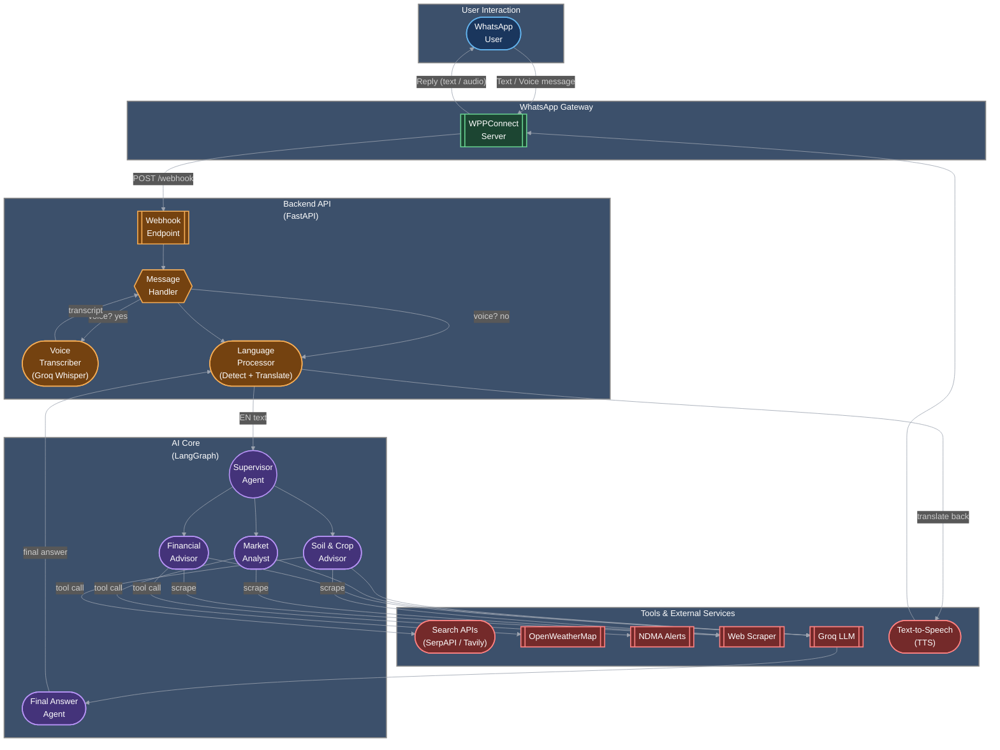

# Agri-Sarthi-WP: AI Agricultural Assistant for WhatsApp

**Agri-Sarthi-WP** brings the power of a sophisticated multi-agent AI assistant directly to farmers through WhatsApp. This platform understands both text and voice messages in multiple languages, providing expert advice on crop management, market prices, weather, and more. It's designed to be the most accessible and intelligent farming companion, right in your pocket.

-----

## Architecture

The system is built on a robust, event-driven architecture that processes WhatsApp messages in real-time. A FastAPI backend orchestrates the flow, from receiving webhooks from WPPConnect to orchestrating the powerful LangGraph agentic core.



-----

## How It Works


1.  **Message Reception**: A user sends a text or voice message to the Agri-Sarthi WhatsApp number.
2.  **Gateway**: The **WPPConnect server** receives the message and forwards it as a webhook to the `/webhook` endpoint of the **FastAPI application**.
3.  **Message Handling**:
      * If the message is a voice note (`ptt`), it's transcribed to text using **Groq Whisper**.
      * The system buffers messages for a few seconds (`WAIT_TIME`) to group related queries from the same user.
4.  **Language Processing**: The user's language is automatically detected. The message is then translated into English to be processed by the AI core.
5.  **AI Agent Workflow (LangGraph)**:
      * The **Supervisor Agent** receives the query and determines the user's intent.
      * It routes the task to the appropriate specialist agent: **Soil & Crop Advisor**, **Market Analyst**, or **Financial Advisor**.
      * The specialist agent uses a suite of tools (e.g., **SerpAPI** for market prices, **OpenWeatherMap** for weather, web scraper) to gather real-time information.
      * The **FinalAnswerAgent** synthesizes the information from the tools into a clear, concise, and helpful response.
6.  **Response Generation**:
      * The final answer is translated back into the user's original language.
      * The text is converted into a voice message using a Text-to-Speech (TTS) service.
7.  **Reply**: The final text or voice message is sent back to the user via the WPPConnect server.

-----

## Getting Started

### Prerequisites

  * Python 3.11+
  * Node.js and npm (for the WPPConnect server)
  * A dedicated WhatsApp number for the bot.

### 1\. Set Up WPPConnect Server

WPPConnect acts as the bridge between WhatsApp and your application.

1.  **Clone the WPPConnect server repository:**

    ```bash
    git clone https://github.com/wppconnect-team/wppconnect-server.git
    cd wppconnect-server
    ```

2.  **Install dependencies:**

    ```bash
    npm install
    ```

3.  **Configure the webhook URL:**
    Open `src/config.ts` and set the `webhook.url` to point to your FastAPI application's webhook endpoint. If you're running locally, you'll need to use a tunneling service like ngrok.

    ```ts
    // src/config.ts
    export default {
      // ...other config
      webhook: {
        url: "http://<your_ngrok_or_public_ip>:8000/webhook",
      },
    };
    ```

4.  **Start the WPPConnect server:**

    ```bash
    npm run dev
    ```

5.  **Authenticate and Start a Session:**

      * Navigate to the Swagger UI at `http://localhost:21465/api-docs`.
      * Use the `/api/start-session` endpoint to create a new session (e.g., `agrisarthi`).
      * Scan the QR code shown in the terminal or Swagger UI with the dedicated WhatsApp account on your phone.
      * Generate a token and copy it for your `.env` file.

### 2\. Set Up the FastAPI Application

1.  **Clone this repository and navigate into it.**

2.  **Create and activate a Python virtual environment:**

    ```bash
    python -m venv venv
    source venv/bin/activate  # On Windows: venv\Scripts\activate
    ```

3.  **Install Python dependencies:**

    ```bash
    pip install -r requirements.txt
    ```

4.  **Create a `.env` file** in the root directory and populate it with your credentials:

    ```env
    # WPPConnect Configuration
    WPPCONNECT_BASE_URL=http://localhost:21465
    WPPCONNECT_SESSION_NAME=agrisarthi # Must match the session name from WPPConnect setup
    WPPCONNECT_TOKEN=your_generated_wppconnect_token

    # AI and Tooling APIs
    GROQ_API_KEY=your_groq_api_key
    SERPAPI_API_KEY=your_serpapi_api_key         # Optional, for market prices
    OPENWEATHERMAP_API_KEY=your_openweathermap_api_key # Optional, for weather
    TAVILY_API_KEY=your_tavily_api_key           # Optional, for web search

    # Application Settings
    WAIT_TIME=2 # Time in seconds to wait for follow-up messages
    ```

### 3\. Run the Application

With both the WPPConnect server and your local tunnel (ngrok) running, start the FastAPI application:

```bash
uvicorn main:app --host 0.0.0.0 --port 8000 --reload
```

You can check if the API is running by visiting the health check endpoint: `http://localhost:8000/health`. Now, you can start sending messages to your WhatsApp bot\!

-----

## Customization

  * **Agent Logic**: To change how the agents behave or route tasks, modify `app/agent.py`.
  * **Tools**: To add new capabilities (e.g., a new API for government schemes), define the function in `tools.py` and add it to the appropriate agent's tool list in `app/agent.py`.
  * **Language & TTS**: To change translation logic or swap the TTS provider, edit the helper functions in `app/sarvam.py`.
  * **Message Buffering**: Adjust the `WAIT_TIME` in your `.env` file to control the message aggregation window.

-----

## Troubleshooting

  * **No Replies:**
      * Ensure your `WPPCONNECT_BASE_URL`, `WPPCONNECT_SESSION_NAME`, and `WPPCONNECT_TOKEN` are correct in the `.env` file.
      * Verify that your ngrok tunnel is active and the URL in the WPPConnect `config.ts` is correct.
      * Check the logs of both the FastAPI and WPPConnect servers for errors.
  * **Voice Transcription Fails:**
      * Confirm your `GROQ_API_KEY` is valid and has credits.
  * **Tool Errors (Weather/Market Prices):**
      * Make sure the respective API keys (`OPENWEATHERMAP_API_KEY`, `SERPAPI_API_KEY`) are correctly set in your `.env` file.
